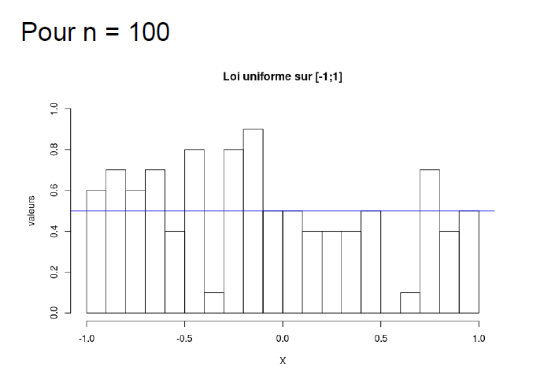
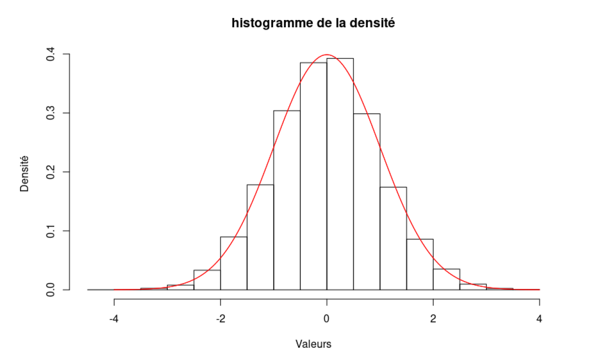

# Probabilités et Simulation : Variables aléatoires réelles

## Simulation de variables aléatoires réelles

### Loi de bernoulli de paramètre p

Exécutez le script `Bernoulli_simulation.r`. Dans la console il y aura bien une suite de variables aléatoires valant 0 ou 1.

### Loi binomiale de paramètre n et p

Exécutez le script `Binomiale_simulation.r`. Dans la console il y aura bien une suite de variables aléatoires valant entre 0 et n.

### Loi géométrique de paramètre p

Exécutez le script `Geometrique_simulation.r`.

### Loi uniforme sur [-1;1]

Exécutez le script `Uniforme_simulation.r`. Voici les graphiques obtenus :

  

On peut observer que plus n est grand, plus on se rapproche de la densité.

## Simulation de variables aléatoires réelles par inversion

### Loi de bernoulli de paramètre p

Exécutez le script `Bernoulli_inversion.r`. Dans la console il y aura bien une variable aléatoire valant 0 ou 1.

### Loi gémoétrique de paramètre p

Exécutez le script `Geometrique_inversion.r`. Voici le graphique obtenu :

### Loi de poisson de paramètre λ

Exécutez le script `Poisson_inversion.r`.

### Loi exponentielle de paramètre λ

Exécutez le script `Exponentielle_inversion.r`. Voici le graphique obtenu :

## Lois des grands nombres

### Loi uniforme sur [0;1]

Exécutez le script `LGN_uniforme.r`. Voici le graphique obtenu :

La suite des moyennes empiriques semble converger vers l'espérance des X_k.

### Loi exponentielle

Exécutez le script `LGN_exponentielle.r`. Voici le graphique obtenu :

La suite des moyennes empiriques semble converger vers l'espérance des X_k.

## Théorème Central Limite

### Convergence de Zn avec Xn qui suit une loi uniforme sur [0;1]

Exécutez le script `TCL_uniforme.r`. Voici le graphique obtenu :

### Convergence en loi de Zn avec Xn qui suit une loi uniforme sur [0;1]

Exécutez le script `TCL_loi_uniforme.r`. Voici le graphique obtenu :

On remarque que Zn converge en loi vers variable qui suit une loi Normale de paramètre (0;1). Ce qui correspond bien au théorème de la limite centrale.

### Convergence de Zn avec Xn qui suit une loi exponentielle sur [0;1]

Exécutez le script `TCL_exponentielle.r`. Voici le graphique obtenu :

### Convergence en loi de Zn avec Xn qui suit une loi exponentielle sur [0;1]

Exécutez le script `TCL_loi_exponentielle.r`. Voici le graphique obtenu :

On remarque que Zn converge en loi vers variable qui suit une loi Normale de paramètre (0;1). Ce qui correspond bien au théorème de la limite centrale.

## Méthode de Box-Muller

Exécutez le script `Box_muller.r`. Voici le graphique obtenu :

On remarque également qu’il y a convergence vers la loi Normale de paramètres (0;1)